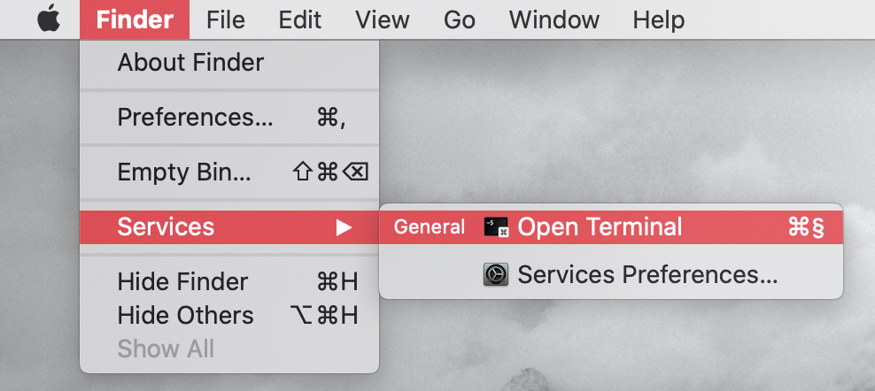
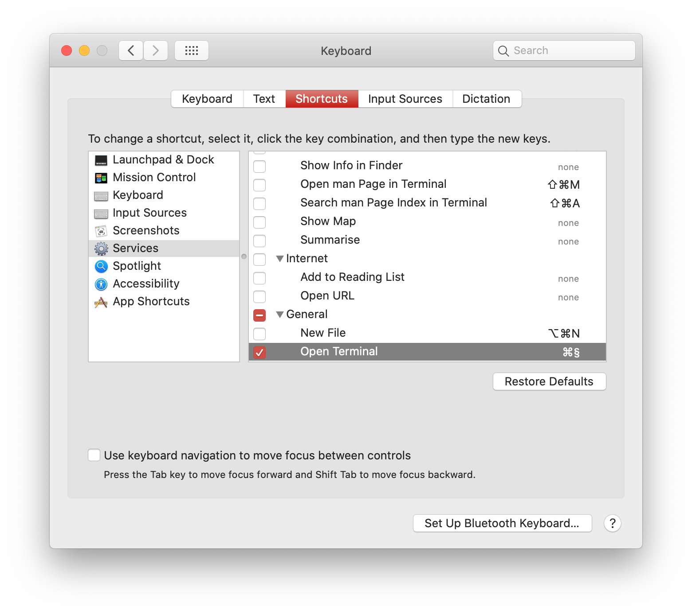

# Shortcut to open Terminal on macOS

MacOS can be really strange. We have preinstalled tools to record screen, but other simple features are missing.
Like the way to open Terminal using simple shortcut.

Today this will change:)

1. Download the app from [Releases](https://github.com/s-valent/mac-terminal-shortcut/releases)
2. Unpack and hide it somewhere where it won't bother you (I choose `/Applications/Utilities`)
3. You will probably need to launch it at least once

If you completed these 3 simple steps, you will see `Open Terminal` option in Service Menu in almost every app

If you are not happy with `⌘⌥J` I choose, you can always go to
`System Preferences / Keyboard / Shortcuts / Services / General / Open Terminal` and change it to whatever you want
(not really, because for some strange reasons Service Shortcuts need `⌘` to work)

**P.S.:** I made this app because the script in Automator for some reasons was inpredictable.
Sometimes it was launching fast, sometimes it was slower than launching Terminal myself. What's the point of shortcut then?)
